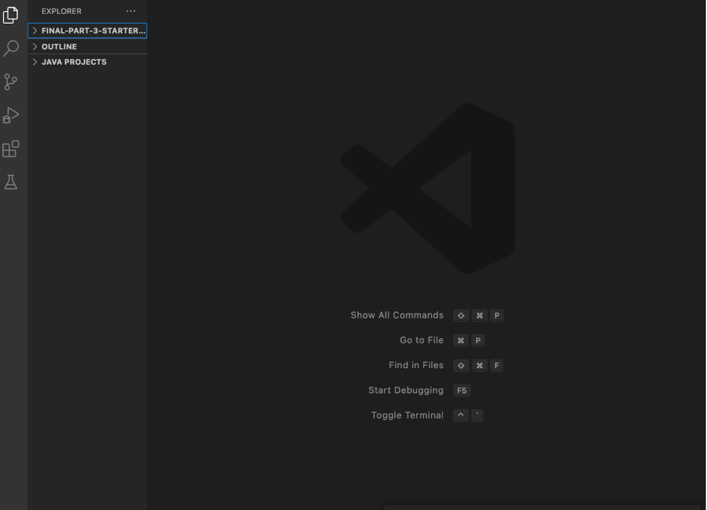
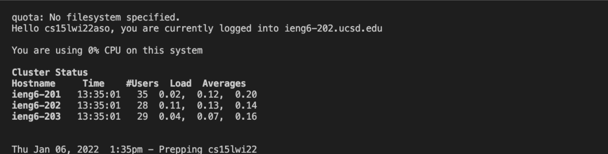
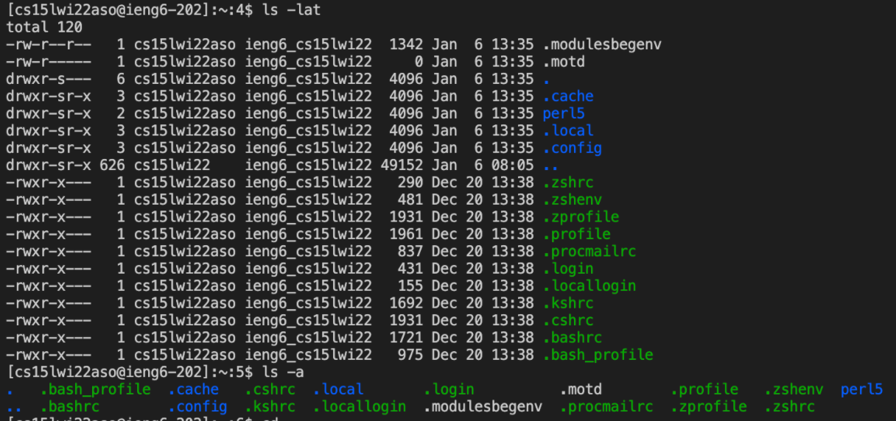
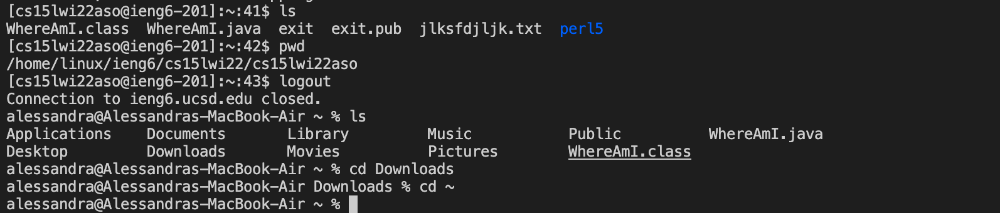
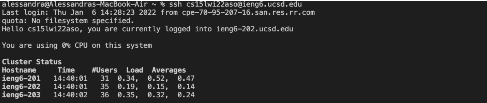
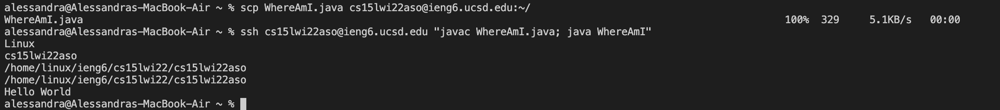

[Lab Report 1](https://amtjitro.github.io/cse15l-lab-reports/lab-report-1-week-2.html)
# Lab Report 1
## *Remote Access*
### Installing VSCode
> I download Visual Studio Code from [this](https://code.visualstudio.com/) website then followed the given instructions to properly install VSCode.
> The following screenshot is what VSCode looks like upon launching the VSCode application.

### Remotely Connecting
> To remotely connect, I first grabbed my CSE15L account. In the terminal I then entered `ssh` followed by my account. I was then prompted to enter my password for the account (the password will not actively show up as you type it). Upon successfully doing so, the following message is printed out.

### Trying Some Commands
> I then tried out some commands on both the client and the server as seen in the screenshots below. For example, I learned that `ls` lists out files and directories, `cd` changes directories, `pwd` lists the current directory you are working in, and so on.

### Moving Files with *scp*
> In the following screenshot I used `scp` to copy over a file called WhereAmI.java to the server. In order to check that it was copied over successfully I used `ssh` to gain access to the server then once in, I used the `ls` command to confirm that WhereAmI.java was copied over.

### Setting an SSH Key
> To create an SSH Key, especially for efficiency purposes, I first typed in 'ssh-keygen' then followed the guidance in the terminal on creating a saving the key. I then logged onto my account on the server using `ssh` then `mkdir .ssh` to create a new directory. After that I used the `scp` command to copy the public key to that new directory and the screenshot below shows me logging into the server without having to type in my password.

### Optimizing Remote Running
> A trick to making running quicker is not only creating an SSH Key, but also learning how to run multiple commands at once. For example, after copying over the WhereAmI.java file to the server, I quickly ran the file by entering the commands after the ssh command. Adding commands in quotes allow me to quickly run WhereAmI.java on the remote server and exit.
