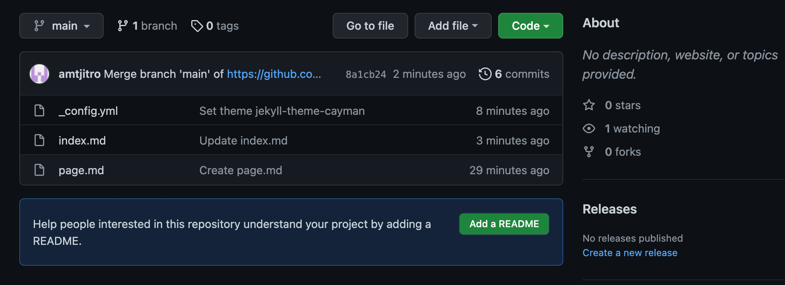

# Week 2 Lab Report
## *Remote Access*
### Installing VSCode
> insert steps

### Remotely Connecting
> insert steps

### Trying Some Commands
> insert steps

### Moving Files with ==scp==
> insert steps

### Setting an SSH Key
> insert steps

### Optimizing Remote Running
> insert steps

lab 2
january 13th
[LAB2](https://ucsd-cse15l-w22.github.io/week/week2/)

[Lab Report 1](page.html)
[Lab Report 1](https://amtjitro.github.io/cse15l-lab-reports/page.html)