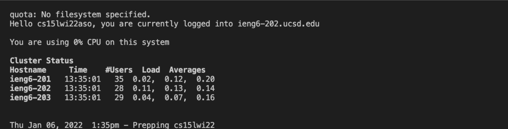
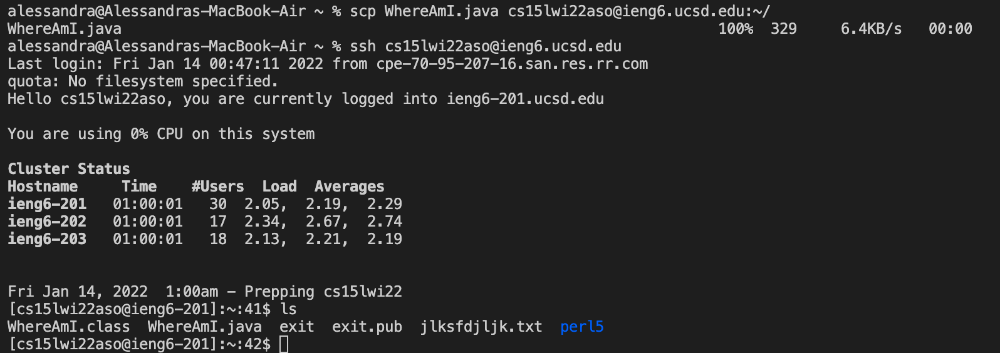
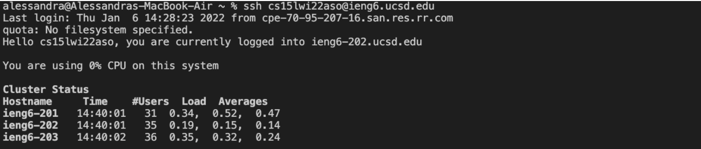

# Lab Report 1
## *Remote Access*
### Installing VSCode
> I had previously already worked with VSCode and had it downloaded from [this](https://code.visualstudio.com/) website. After following the instructions to complete the installation, the following screenshot is what VSCode looks like upon launching the application.

### Remotely Connecting
> To remotely connect, I first grabbed my CSE15L account. In the terminal I then entered `ssh` followed by my account. I was then prompted to enter my password for the account (the password will not actively show up as you type it). Upon successfully doing so, the following message is printed out.

### Trying Some Commands
> I then tried out some commands on both the client and the server as seen in the screenshots below. After experimenting with a couple commands, I assumed that `ls` lists out files and directories, `cd` changes directories, `pwd` lists the current directory you are working in, and so on.

### Moving Files with `scp`
> In the following screenshot I used `scp` to copy over a file called WhereAmI.java to the server. In order to check that it was copied over successfully I used `ssh` to gain access to the server then once in, I used the `ls` command to confirm that WhereAmI.java was copied over.

### Setting an SSH Key
> To create an SSH Key, for efficiency purposes, I first typed in 'ssh-keygen' then followed the guidance in the terminal on creating a saving the key to my own computer. I then logged onto my account on the server using `ssh` then `mkdir .ssh` to create a new directory. After that, I logged out of the server and used the `scp` command to copy the public key to that new directory. The screenshot below shows me logging into the server without having to type in my password.

### Optimizing Remote Running
> A trick to making running quicker is not only creating an SSH Key, but also learning how to run multiple commands at once, and using the up arrow on your keyboard. For example, for running a class on a remote server we'd typically run each command separately like so:

This takes around 71 keystrokes as we have to separately log onto the remote server, compile and run the file, and exit. Alternatively, we can use fewer keystrokes by doing the following. After copying over the WhereAmI.java file to the server, I was able to `ssh` and run WhereAmI.java on the server using one line in the terminal. Adding additional commands on that same line in quotes allow me to quickly run WhereAmI.java on the remote server and exit.

As opposed to 71 keystrokes, this only took 68 keystrokes and one command line. In this particular situation, using the example above requires less keystrokes as we do not have to manually type `exit` to exit out of the remote server.
Another alternative way to run remotely is to use the up arrow on your keyboard. For example, to run remotely again using the example from the second screenshot, instead of having to type out `ssh cs15lwi22aso@ieng6.ucsd.edu"javac WhereAmI.java; java WhereAmI"` once more, you could press the up arrow to get your previous command. Using the up arrow could use only 2 keystrokes (up arrow and enter) as opposed to typing the whole command out once more with 68 keystrokes.