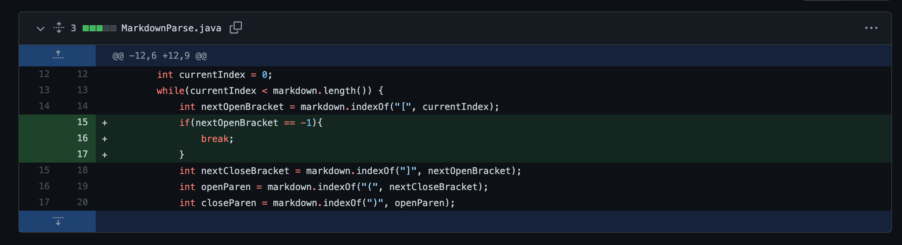
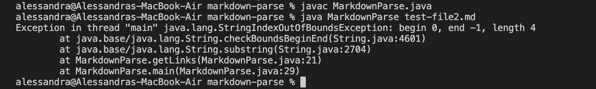
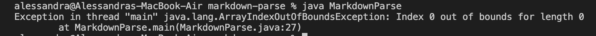
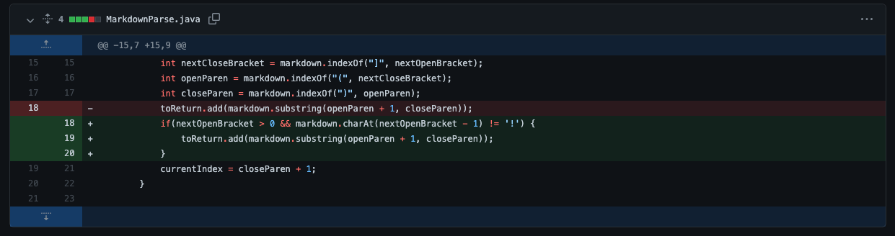
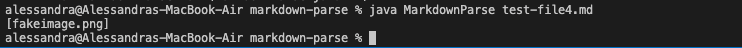

# Lab Report 2
## *Debugging*
### Bug/Fix #1

> ***Code Change***

This is the the first code change for a failing test:

> ***Failure-Induing Input***

[This](https://github.com/amtjitro/markdown-parse/blob/main/test-file2.md) is a link to the test file that prompted this code change.

> ***Symptom***

The following screenshot is the symptom of the bug:

The **bug** is brought about by the fact that the program assumes that there will always be a link in the file and fails to consider/accomodate for this situation. The specific line with the bug that causes the symptom is `toReturn.add(markdown.substring(openParen + 1, closeParen)` as `closeParen` will be -1 leading to an error. Since the **failure-inducing input** is a file with no links, a symtpom will appear. In this case, the **symptom** is a faulty behavior as an `IndexOutOfBounds` exception is thrown when the correct output would be an empty list.

---
### Bug/Fix #2

> ***Code Change***

This is the the second code change we made for a failing test:

> ***Failure-Induing Input***

[This]() is a link to the test file that prompted this code change.

> ***Symptom***

The following screenshot is the result of using the above test file with the unchanged code:

---

### Bug/Fix #3

> ***Code Change***

This is the the third code change we made for a failing test:

> ***Failure-Induing Input***

[This](https://github.com/amtjitro/markdown-parse/blob/main/test-file4.md?plain=1) is a link to the test file that prompted this code change.

> ***Symptom***

The following screenshot is a result of running the test file above before changing the code:

The **bug** is brought about by the fact that the program does not consider the case in which an image is provided as the format for adding an image is very similar to that of a link. The difference between the formatting of a link and an image is the `!` when adding an image and the program fails to detect this as an image. The **failure-inducing input** is a markdown file that has an image. This results in a **symptom** as the output is incorerct. The name of the image file is given as the output when it should be an empty list as an image is not a link. 

---