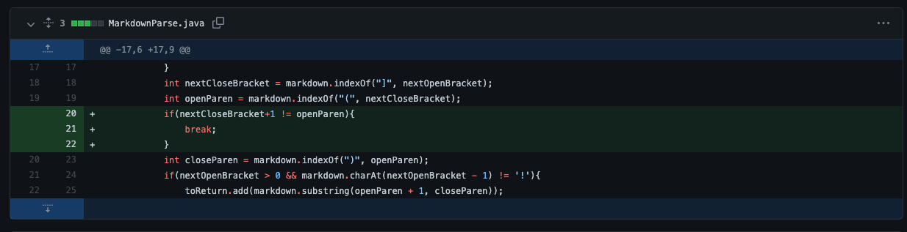
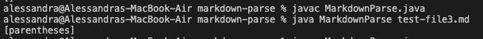

# Lab Report 2
## *Debugging*
### Bug/Fix #1

> ***Code Change***

This is a code change to fix a failing test:

> ***Failure-Inducing Input***

[This](https://github.com/amtjitro/markdown-parse/blob/main/test-file2.md) is a link to the test file that prompted this code change.

> ***Symptom***

The following screenshot is the symptom of the bug:

The **bug** is brought about by the fact that the program assumes that there will always be a link in the file and fails to consider/accomodate for this situation. The specific line with the bug that causes the symptom is `toReturn.add(markdown.substring(openParen + 1, closeParen)` as `closeParen` will be -1 leading to an error. Since the **failure-inducing input** is a file with no links, a symtpom will appear. In this case, the **symptom** is a faulty behavior as an `IndexOutOfBounds` exception is thrown when the correct output would be `[]`.

---
### Bug/Fix #2

> ***Code Change***

This is another code change to fix a failing test:

> ***Failure-Inducing Input***

[This](https://github.com/amtjitro/markdown-parse/blob/main/test-file3.md) is a link to the test file that prompted this code change.

> ***Symptom***

The following screenshot is the symptom of the bug:

The **bug** is brought about by the fact that the program does not take into account that brackets and parentheses can be used as plain text, not necessarily just for links. Therefore the **failure-inducing input** is a markdown file that uses `[]` and `()` as plain text, not in the format for a link. The resulting **symptom** is that the output is incorrect as it gives the contents within the parentheses which is not a link when the correct output should be an `[]`.

---

### Bug/Fix #3

> ***Code Change***

This is another code change to fix a failing test:

> ***Failure-Inducing Input***

[This](https://github.com/amtjitro/markdown-parse/blob/main/test-file4.md?plain=1) is a link to the test file that prompted this code change.

> ***Symptom***

The following screenshot is a symptom of the bug:

The **bug** is brought about by the fact that the program does not consider the case in which an image is provided as the format for adding an image is very similar to that of a link. The difference between the formatting of a link and an image is the `!` and the program fails to detect this as an image. The **failure-inducing input** is a markdown file that has an image. This results in a **symptom** as the output is incorerct. The name of the image file is given as the output when it should be `[]`. In order to fix this bug, the change I made to the code was to only allo the program to proceed if `!` does not directly proceed `[`. This servers to differentiate between the syntax for a link and an image.

---