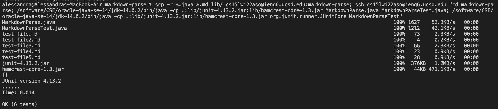

# Lab Report 3
# Copy Whole Directories With `scp -r`

### Copying  whole markdown-parse directory to ieng6 account

Using the command `scp -r . cs15lwi22aso@ieng6.ucsd.edu:~/markdown-parse` I was able to copy the entire markdown-parse directory recursively with `scp -r`. The following screenshots are the output/result of copying my entire `markdown-parse` directory into my ieng6 account.

### Logging into ieng6 account & compiling and running the tests

After I copied the entire directory, I used `ssh` to log into my ieng6 account and then used `ls` to ensure that the directory was correctly copied over. 

Then, I ran the JUnit tests on my ieng6 account using `javac -cp .:lib/junit-4.13.2.jar:lib/hamcrest-core-1.3.jar MarkdownParse.java MarkdownParseTest.java` and `java -cp .:lib/junit-4.13.2.jar:lib/hamcrest-core-1.3.jar org.junit.runner.JUnitCore MarkdownParseTest`. The following output shows that the tests successfully ran.

### Copying the whole directory and running the tests in one line.

I also can copy the entire `markdown-parse`directory and run the tests on my ieng6 account in one line. I did this by using `;` and `"` in order to first copy over the directry with `scp -r`, logging into ieng6 with `ssh`, using `cd` to enter the `markdown-parse` directory, and running the JUnit tests. In order to run the JUnit tests on my ieng6 account in one line with the other commands, I had to replace `javac` and `java` with `/software/CSE/oracle-java-se-14/jdk-14.0.2/bin/java`.

