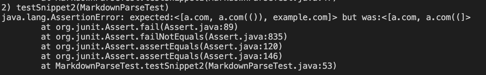

# Lab Report 4

> **Links**

[My repository](https://github.com/amtjitro/markdown-parse)

[Other repository](https://github.com/pvijay03/markdown-parse)

> **Snippet 1**

The first snippet we will be reviewing is:
```
`[a link`](url.com)

[another link](`google.com)`

[`cod[e`](google.com)

[`code]`](ucsd.edu)
```

According to VScode preview, the output of running this snippet through MarkdownParse should be ``['google.com, google.com, ucsd.edu]``.

This is the test I have added in both repository's `MarkdownParseTest.java`


Running this test on my implementation failed and resulted in the following output


Running this test on the repository we reviewed resulted in the following output


It appears that the backtick in front of the first open bracket should not be considered a link, but both repository codes still process it as a link. A potential change that can be made to account for backticks, is to make sure that the program does not continue if a backtick preceeds the `[`. The last link when tested in my own repository does not print but that is not due to the backticks, it is due to the fact that there are two `]` which could be solved by making `nextClosedBracket` the bracket that directly preceeds `(`. But going back to the backticks, a solution would be to add if statements that break the loop if a backtick preceeds the link format.

> **Snippet 2**

The second snippet we will be reviewing is
```
[a [nested link](a.com)](b.com)

[a nested parenthesized url](a.com(()))

[some escaped \[ brackets \]](example.com)
```

According to VScode preview, the output of running this snippet through MarkdownParse should be ``[a.com, a.com(()), example.com]``.

This is the test I have added in both repository's `MarkdownParseTest.java`


Running this test on my implementation failed and resulted in the following output



Running this test on the repository we reviewed resulted in the following output


It appears that my implementation does not correctly account for `a.com(())` or `example.com`. The other repository only does not account for `a.com(())`. A way to fix this would be to print out the entire link up to character right before the last closed parentheses. Additionally, there could be code to check if there are matching open and close brackets in the bracket part of a link.

> **Snippet 3**
The third snippet we will be reviewing is 

```
[this title text is really long and takes up more than 
one line

and has some line breaks](
    https://www.twitter.com
)

[this title text is really long and takes up more than 
one line](
    https://ucsd-cse15l-w22.github.io/
)


[this link doesn't have a closing parenthesis](github.com

And there's still some more text after that.

[this link doesn't have a closing parenthesis for a while](https://cse.ucsd.edu/


)

And then there's more text
```
According to VScode preview, the  output of running this snippet through MarkdownParse should be ``[https://www.twitter.com, https://ucsd-cse15l-w22.github.io/, https://cse.ucsd.edu/]``.

This is the test I have added in both repository's `MarkdownParseTest.java`


Running this test on my implementation failed and resulted in the following output


Running this test on the repository we reviewed resulted in the following output


On the other repository, nothing is printed as the author decided to parse through the file line by line, not necessarily just by open and close brackets or parentheses. This would lead to a more involved code change. Otherwise, a potential way to fix this is to strip/replace all the new line characters perhaps by using the `replaceAll` function. You would have to replace new line characters that are contained within parentheses or brackets and then continue the program after doing so.