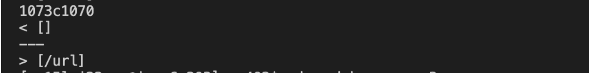
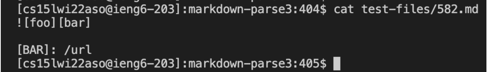
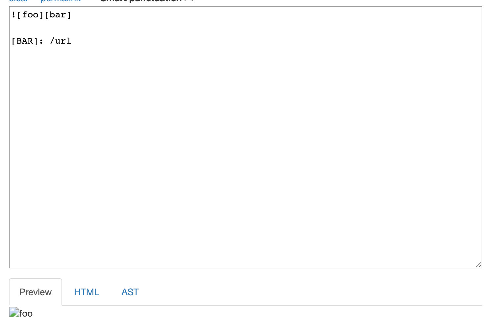
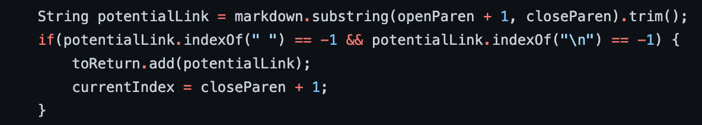
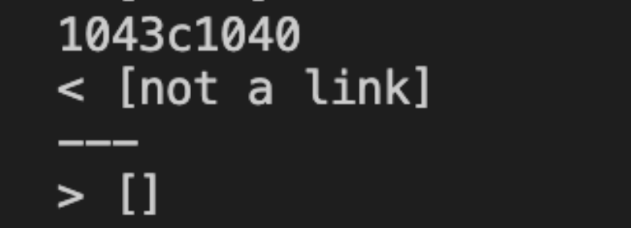
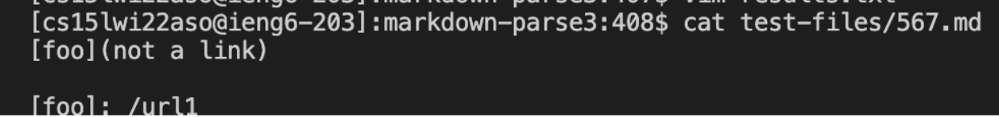
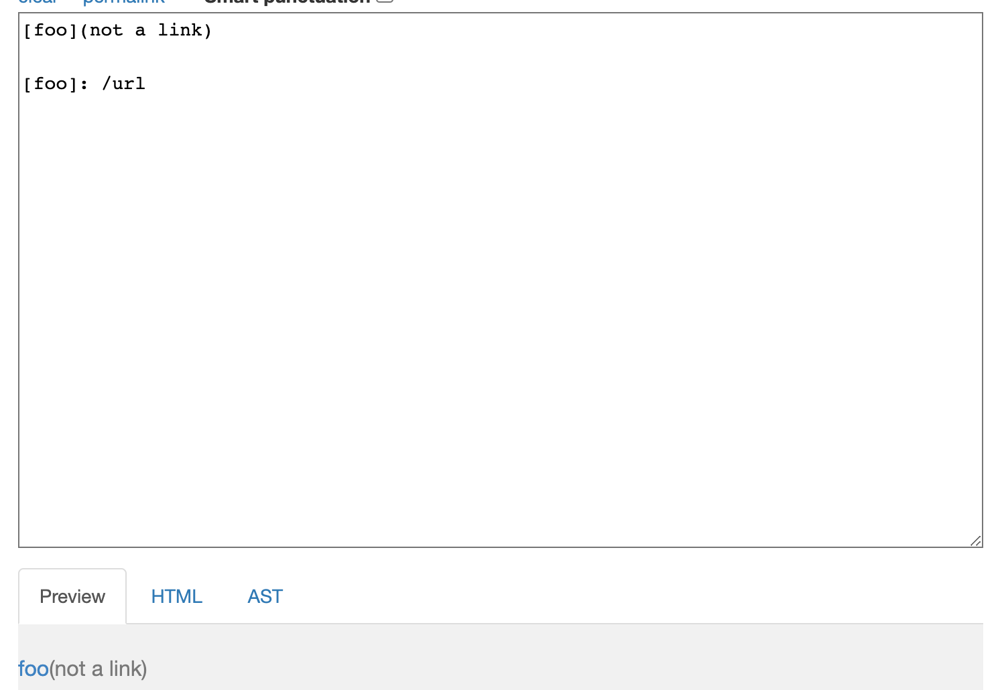
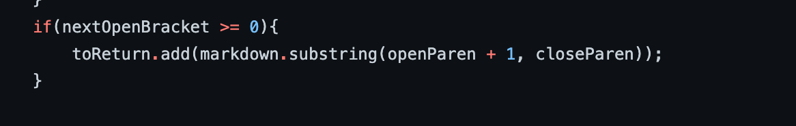

# Lab Report 5

I found these tests using `diff` on the results of running a bash for loop. Upon doing so, it printed out the differences and I could tell where the implementations differed. The result revealed to me which line
that the difference was on and I could search through the results to find the test that led to different outputs.

>**Test 1**

This is the first difference I found between my implementation and the provided implementation.

This is the test file itself:

and this is the expected output of the test file:

The incorrect implementation is the given implementation as it returns `[/url]` when it should return `[]`. A fix could be to add an additional statement in the if statement below.

The bug is that the program does not check that the open parentheses is right next to the closed pracket. If the program did so, it would not have considered `\url` as a link and therefore the method would have stopped there. Therefore, the if statement should include an additional check that would check that `openParen = closeBracket +1`.

>**Test 2**

This is the second difference I found between the two implementations.

This is the test file:

As shown in the screenshot below, the expected output is `[]`.

Thereore, my implementation is incorrect as it returns `[not a link]`. 

The bug in this program is that it does check that the text inside the parentheses is actually a valid link. A potential fix to this is to add a nested if statement in the if statement below to check that the text inside the parentheses has no spaces as links typically don't have spaces.
